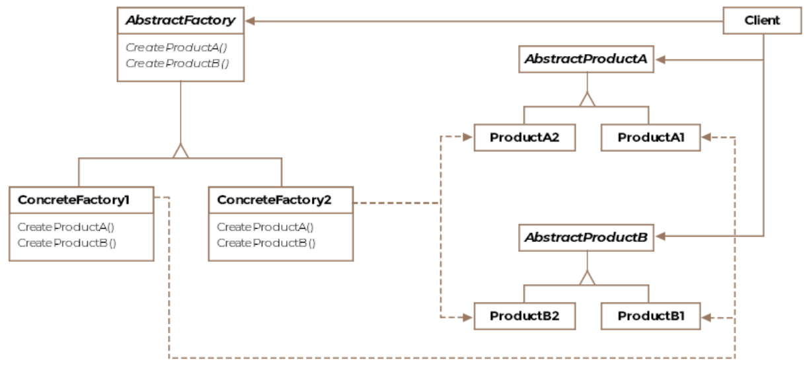

# Abstract Factory Design Pattern

The abstract factory design pattern allows to create a familiy of products
in a flexible and extensible manner.

This pattern can be used when there a group of products to be produced and
these products can exist in different versions (e.g. chair, table, sofa from
different styles).

## Class Diagram



## Example

The interface of the abstract factory:
Note, the create methods return interfaces, not concrete objects.
```Java
public interface IAircraftFactory {

    IEngine createEngine();

    IWings createWings();

    ICockpit createCockpit();
}
```

Below the implementation of the factories for each type of
airplane. The create methods are actually factory methods. The
abstract factory pattern utilizes the factory mehtod pattern.
```Java
public class F16Factory implements IAircraftFactory {

    @Override
    public IEngine createEngine() {
        return new F16Engine();
    }

    @Override
    public IWings createWings() {
        return new F16Wings();
    }

    @Override
    public ICockpit createCockpit() {
        return new F16Cockpit();
    }
}

public class Boeing747Factory implements IAircraftFactory {

    @Override
    public IEngine createEngine() {
        return new Boeing747Engine();
    }

    @Override
    public IWings createWings() {
        return new Boeing747Wings();
    }

    @Override
    public ICockpit createCockpit() {
        return new Boeing747Cockpit();
    }
}
```

```Java
public class Client {

    public void main() {

        // Instantiate a concrete factory for F-16
        F16Factory f16Factory = new F16Factory();

        // Instantiate a concrete factory for Boeing-747
        Boeing747Factory boeing747Factory = new Boeing747Factory();

        // Lets create a list of all our airplanes
        Collection<Aircraft> myPlanes = new ArrayList<>();

        // Create a new F-16 by passing in the f16 factory
        myPlanes.add(new Aircraft(f16Factory));

        // Create a new Boeing-747 by passing in the boeing factory
        myPlanes.add(new Aircraft(boeing747Factory));

        // Fly all your planes
        for (Aircraft aircraft : myPlanes) {
            aircraft.fly();
        }

    }
}
```
