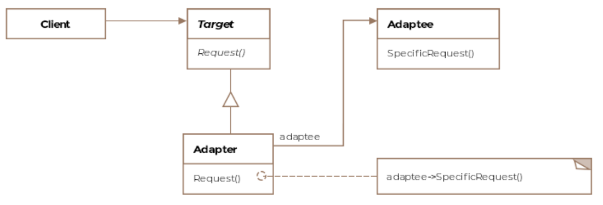

# Adapter Pattern

The adapter pattern is defined as allowing incompatible classes
to work together by converting the interface of one class into
another expected by the clients.

When two heads of states who don't speak a common language meet,
usually a language interpreter sits between the two and translates
the conversation, thus enabling communication. 

The Adapter pattern is similar in that it sits between two incompatible
classes that otherwise can't work with eachother and lets them work
together.

## Class diagram



## Code

Let's take our aircraft example again. Your software only deals with
fancy jets but suddenly you are required to adapt your software to cater
to a local hot air balloon company. Rewriting your software from scratch
is not feasible. To complicate matters the balloon company already
provides you with classes that represent hot air balloons which are
incompatible with your IAircraft interface, which you use to represent
modern aircraft. We'll use the adapter pattern to make the hot air
balloon classes work with our existing infrastructure for aircraft. 
Let's see what the balloon class looks like:

```Java
public class HotAirBalloon {

    String gasUsed = "Helium";

    void fly(String gasUsed) {
        // Take-off sequence based on the kind of fuel
        // Followed by more code.
    }

    // Function returns the gas used by the balloon for flight
    String inflateWithGas() {
        return gasUsed;
    }
}
```

The problem here is that the `fly` method takes an argument which our
`IAircraft` interface doesn't.

```Java
public interface IAircraft {
    void fly();
}
```

The adapter implementation would therefore be the following:
```Java
public class Adapter implements IAircraft {

    HotAirBalloon hotAirBalloon;

    public Adapter(HotAirBalloon hotAirBalloon) {
        this.hotAirBalloon = hotAirBalloon;
    }

    @Override
    public void fly() {
        String fuelUsed = hotAirBalloon.inflateWithGas();
        hotAirBalloon.fly(fuelUsed);
    }
}
```
Note: 
1. The Adapter is composed (takes an argument in the constructor) with
the `HotAirBalloon` object.
1. The Adapter implements the interface `IAircraft`.

The client code would then look like:
```Java
public void main() {

    HotAirBalloon hotAirBalloon = new HotAirBalloon();
    Adapter hotAirBalloonAdapter = new Adapter(hotAirBalloon);

    hotAirBalloonAdapter.fly();
}
```

## Object Adapter vs Class Adapter

The above example is an object adapter.
The class adapter would implement the `IAircraft` interface as well
as inherite from the `HotAirBalloon` class. But as Java doesn't support
multiple inheritance, it can't do a class adapter.


