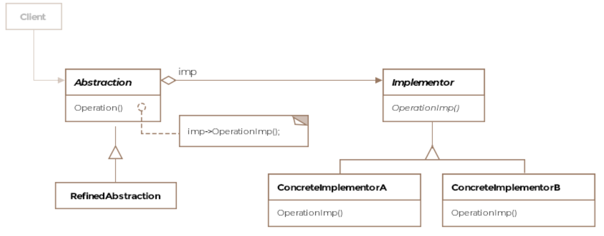
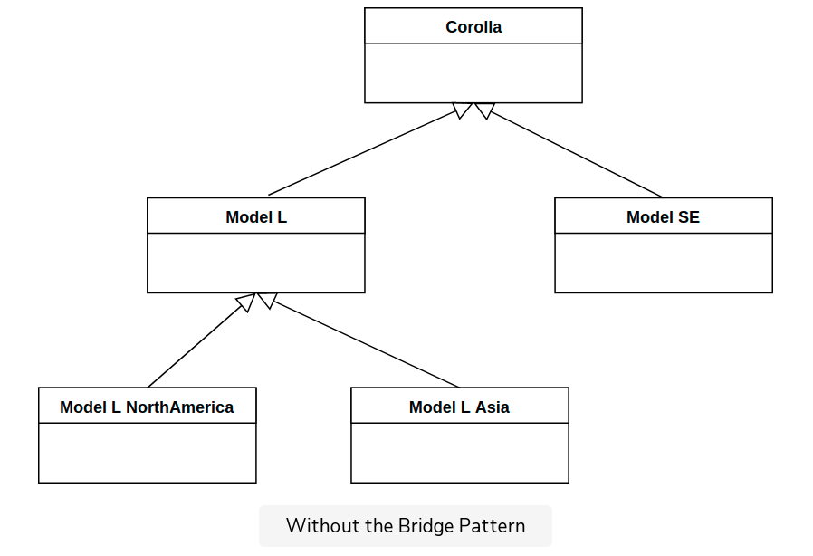
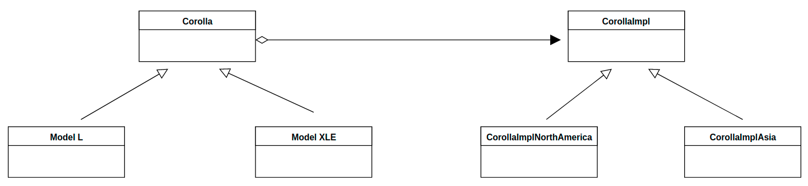

# Bridge Pattern

A physical bridge provides connectivity between two points.
The bridge pattern describes how to pull apart two software layers 
fused together in a single class hierarchy and change them into
parallel class hierarchies connected by a bridge.

The bridge pattern can be applied to scenarios where the class and
what it does changes often. Think of it as two layers of abstraction.
The class itself becomes one layer and what it does i.e. the 
implementation becomes another layer. This setup allows us to extend
the two layers independently of each other.

## Class Diagram



## Code

The following example is about the Toyota model Corolla and it's
various model types and variations for a different locale (e.g.
left hand drive, right hand drive)



We can divide the above class structure into two hierarchies.
One that just represents the models of the car and another that
represents the location-specific variations for each model of the car.



The implementation side has it's own class hierarchy. The class `Corolla`
holds a reference to an object of class `CorollaImpl`.

The abstract class `AbstractCorolla`: 
```Java
public abstract class AbstractCorolla {

    protected AbstractCorollaImpl corollaImpl;

    public AbstractlCorolla(AbstractCorollaImpl corollaImpl) {
        this.corollaImpl = corollaImpl;
    }

    abstract void listSafetyEquipment();

    abstract boolean isCarRightHanded();
}
```

The class `AbstractCorolla` holds a reference to an object of class
`AbstractCorolla`.

```Java
public abstract class AbstractCorollaImpl {

    abstract void listSafetyEquipment();

    abstract boolean isCarRightHanded();
}
```

The class that represents the model L is shown below:
```Java
public class Corolla_L extends AbstractCorolla {

    public Corolla_L(AbstractCorollaImpl corollaImpl) {
        super(corollaImpl);
    }

    @Override
    void listSafetyEquipment() {
        corollaImpl.listSafetyEquipment();

    }

    @Override
    boolean isCarRightHanded() {
        return corollaImpl.isCarRightHanded();
    }
}
```

And the implementation:
```Java
public class Corolla_L_Impl_AsiaPacific extends AbstractCorollaImpl {

    @Override
    void listSafetyEquipment() {
        System.out.println("Not so safe.");
    }

    @Override
    boolean isCarRightHanded() {
        return false;
    }
}

public class Corolla_L_Impl_NorthAmerica extends AbstractCorollaImpl {

    @Override
    void listSafetyEquipment() {
        System.out.println("High safety standards.");
    }

    @Override
    boolean isCarRightHanded() {
        return true;
    }
}
```

The client would use the classes as follows:
```Java
public class Client {

    public void main() {

        AbstractCorolla myCorolla = new Corolla_L(new Corolla_L_Impl_AsiaPacific());
        System.out.println(myCorolla.isCarRightHanded());

        myCorolla.setCorollaImpl(new Corolla_L_Impl_NorthAmerica());
        System.out.println(myCorolla.isCarRightHanded());
    }
}
```

Note how the client can switch out the implementation class object at
runtime and make the model behave for an entirely different location.
Using the bridge pattern we have avoided permanent binding of models
and their intended locations of operation. The client can continue to
work with the objects of the abstraction layer without noticing any
changes to implementation layer classes. New safety rules or regulations
would only affect the implementation layer classes.

## Caveats

The bridge pattern may be confused with the adapter pattern but one
difference between the two is that the adapter pattern is usually applied
after a system is designed whereas the bridge pattern is intentionally
applied as part of the design process to decouple the two layers.
