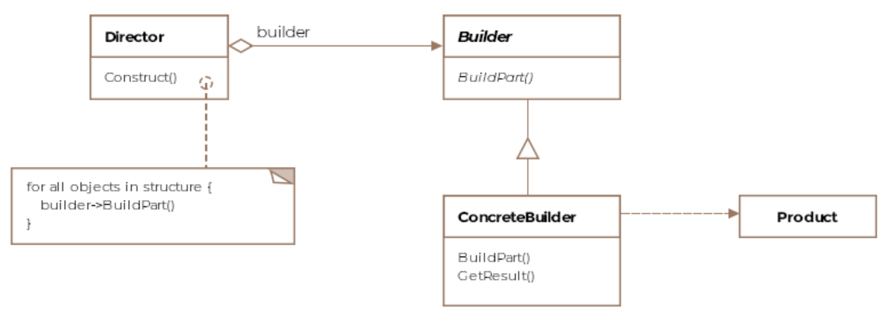

# Builder Pattern

The builder pattern constructs and represents complex object without coupling the two operations.

If we have objects of the same kind but with different attributes, we can use the builder pattern
to construct both of these variations.

For example an airplane could be a F-16 figher jet or a Boeing 747 the two are both airplanes
but a Boing 474 has a bathroom whereas the F-16 has not.

## Class Diagram



### Director

The director builds the parts that the builder interface provides.

### Builder Interface

The builder interface defines the methods that a concrete builder has to provide.
Each builder implements a method `getResult()` to get the final product.

## Example

F16 and Boeing 747 would derive from the `AircraftBuilder`.

```Java
    public abstract class AircraftBuilder {

        public void buildEngine() {

        }

        public void buildWings() {

        }

        public void buildCockpit() {

        }

        public void buildBathrooms() {

        }

        abstract public IAircraft getResult();
    }
```


