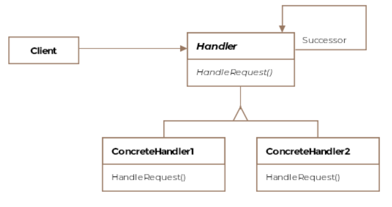

# Chain of Responsibility Design Pattern

This pattern lets a request travel down a chain of handlers till an
appropriate handler is found.

In a chain of responsibility pattern implementation, the sender's request is
passed down a series of handler objects till one of those objects, handles the
request or it remains unhandled and falls off the chain. Multiple objects are
given a chance to handle the request. This allows us to decouple the sender
and the receiver of a request.

The requestor has no knowledge of the object that will eventually handle its
request nor does it have a reference to the handling object. Similarly, the
object eventually handling the request isn't aware of the requestor.

Usually the pattern is applied when the request can be handled by multiple
objects and it is not known in advance which object will end up handling the
request.

## Class Diagram



## Example

Imagine an aircraft's cockpit. It would be running some software that would indicate to the pilot about equipment failure, engine temperature, or something as disastrous as a fire. Let's say when some failure happens, the hardware sends an error code to the cockpit's computer which then takes some corrective action based on the error code it receives.

We can model the error codes as requests that require handling by appropriate components. Say, if an engine failure happens, there might be a series of corrective actions that can try to fix the problem successively. For instructional purposes, say the hardware can send out either a fire detected or a low on fuel request, which have corresponding handlers. Let's see the listing for AbstractHandler and AbstractRequest classes first.

```Java
abstract public class AbstractRequest {

    // Each request is identified by a an integer
    // FireRequest: 1
    // LowFuelRequest: 2
    private int requestCode;

    public AbstractRequest(int requestCode) {
        this.requestCode = requestCode;
    }

    public int getRequestCode() {
        return requestCode;
    }
}

abstract public class AbstractHandler {

    private AbstractHandler next;

    public AbstractHandler(AbstractHandler next) {
        this.next = next;
    }

    public void setNext(AbstractHandler next) {
        this.next = next;
    }

    public void handleRequest(AbstractRequest request) {
        if (next != null) {
            next.handleRequest(request);
        }
    }
}
```

The naive implementations of the classes LowFuelRequest and
FireDetectedRequest appear below alongside the implementation for the concrete
handler FireHandler. We skip the implementation for LowFuelHandler as it would
be similar to FireHandler.

```Java
public class FireDetectedRequest extends AbstractRequest {

    // Fire request is assigned code of 1
    public FireDetectedRequest() {
        super(1);
    }
}

public class LowFuelRequest extends AbstractRequest {

    // Low on fuel request is assigned code of 2
    public LowFuelRequest() {
        super(2);
    }
}

public class FireHandler extends AbstractHandler {

    // Only interested in handling requests with code 1
    private static int code = 1;

    public FireHandler(AbstractHandler successor) {
        super(successor);
    }

    @Override
    public void handleRequest(AbstractRequest request) {
        if (code == request.getRequestCode()) {
            // Handle the request here.
        } else {
            // If the handler, doesn't handle these type of
            // requests, it can just call the super class's
            // forward request method.
            super.handleRequest(request);
        }
    }
}
```

Finally the interaction between these different classes is exhibited in the
client code.

```Java
public class Client {

    public void main() {

        // Setup the chain like so:
        // FireHandler --> LowFuelHandler --> null
        // The chain has just two handlers with the firstHandler
        // at the head of the chain.
        AbstractHandler lowFuelHandler = new LowFuelHandler(null);
        FireHandler fireHandler = new FireHandler(lowFuelHandler);

        // Create a emergency request that the airplane is running low
        // on fuel.
        LowFuelRequest lowFuelRequest = new LowFuelRequest();

        // Let the chain handle the request
        fireHandler.handleRequest(lowFuelRequest);
    }
}
```

Notice, how in our example, the request moves along the chain till a handler
that is capable of addressing the request receives it. The chain also defines
an order in which the request gets handled. If more than one handler can serve
the request, then it'll get handled by the one occurring first in the chain.


