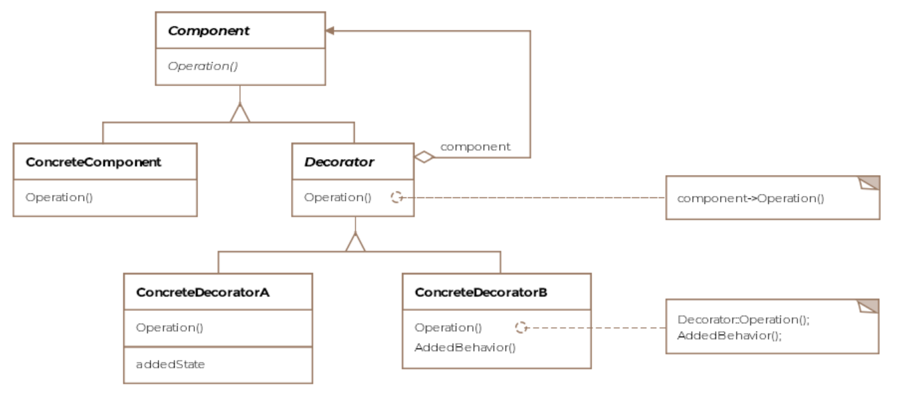

# Decorator Pattern

The decorator pattern enhances objects with new behavior.

## Class Diagram

The decorator pattern can be thought of as a wrapper or more formally
a way to enhance or extend the behavior of an object dynamically. The
pattern provides an alternative to subclassing when new functionality
is desired.



## Code

To better understand the decorator pattern, let's go back to our aircraft
example. The aircraft are produced somewhat similar to cars. There's the
base model of a car and then there are optional packages that a customer 
can request to be added to the car. For instance a car can have a technology
package added to the base model, then maybe the sports package so on and
so forth. Similarly, our base Boeing-747 model can have two additional
properties added to it. One is to let the plane be fitted with luxury
fittings and the other is making the plane bullet-proof.

Say we are interested in the weight of our plane, which can be important
in determining the fuel required for flights. Adding either or both of
the options would make the plane heavier. We would want an extensible
way of adding properties to the plane object and still be able to know
its weight with the additional packages installed on the plane.

Let's first see how the aircraft interfaces and classes look like:

```Java
public interface IAircraft {

    float baseWeight = 100;

    void fly();

    void land();

    float getWeight();

}

public class Boeing747 implements IAircraft {

    @Override
    public void fly() {
        System.out.println("Boeing-747 flying ...");
    }

    @Override
    public void land() {
        System.out.println("Boeing-747 landing ...");
    }

    @Override
    public float getWeight() {
        return baseWeight;
    }
}
```

The decorator pattern requires an abstract decorator class that implements
the abstract interface for the object being wrapped. In this case, we call
our decorator `BoeingDecorator` and have it implement the `IAircraft` interface.

```Java
public abstract class BoeingDecorator implements IAircraft {

}
```

We'll have two concrete decorators, one for the luxury fittings and the other
for bullet proofing the plane.

```Java
public class LuxuryFittings extends BoeingDecorator {

    IAircraft boeing;

    public LuxuryFittings(IAircraft boeing) {
        this.boeing = boeing;
    }

    @Override
    public void fly() {
        boeing.fly();
    }

    @Override
    public void land() {
        boeing.land();
    }

    @Override
    public float getWeight() {
        return (30.5f + boeing.getWeight());
    }
}

public class BulletProof extends BoeingDecorator {

    IAircraft boeing;

    public BulletProof(IAircraft boeing) {
        this.boeing = boeing;

    }

    @Override
    public void fly() {
        boeing.fly();
    }

    @Override
    public void land() {
        boeing.land();
    }

    @Override
    public float getWeight() {
        return 50f + boeing.getWeight();
    }
}
```

The client would then use the object like so:
```Java
public class Client {

    public void main() {
        IAircraft simpleBoeing = new Boeing747();
        IAircraft luxuriousBoeing = new LuxuryFittings(simpleBoeing);
        IAircraft bulletProofBoeing = new BulletProof(luxuriousBoeing);
        float netWeight = bulletProofBoeing.getWeight();
        System.out.println("Final weight of the plane: " + netWeight);
    }
}
```
