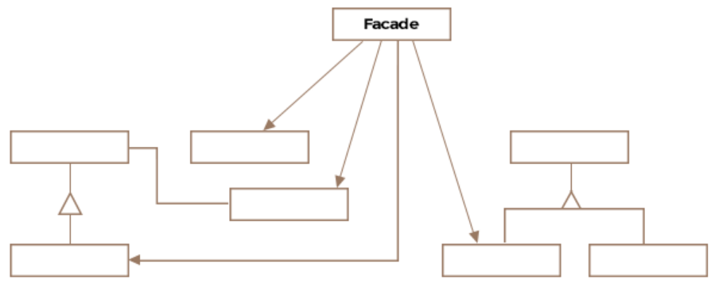

# Facade Design Pattern

Formally the facade pattern is defined as a single uber interface to one or
more subsystems or interfaces intending to make use of the subsystems easier.

It's purpose is to hide the complexity of an interface or a subsystem.

## Class Diagram



## Example

Modern aircrafts have a feature called autopilot that allows the airplane to
fly to its destination in an automated fashion without much interference from
human pilots. The autopilot feature needs to juggle with all the subsystems
and health-checks of the aircraft to ensure a smooth flight. It can hide away
all the underlying complexity of automated flight from a pilot. Let's look at 
how the Boeing autopilot facade would be created:

```Java
public class AutopilotFacade {

    private BoeingAltitudeMonitor altitudeMonitor;
    private BoeingEngineController engineController;
    private BoeingFuelMonitor fuelMonitor;
    private BoeingNavigationSystem navigationSystem;

    public AutopilotFacade(BoeingAltitudeMonitor altitudeMonitor, BoeingEngineController engineController,
                           BoeingFuelMonitor fuelMonitor, BoeingNavigationSystem navigationSystem) {
        this.altitudeMonitor = altitudeMonitor;
        this.engineController = engineController;
        this.fuelMonitor = fuelMonitor;
        this.navigationSystem = navigationSystem;
    }

    public void autopilotOn() {
        altitudeMonitor.autoMonitor();
        engineController.setEngineSpeed(700);
        navigationSystem.setDirectionBasedOnSpeedAndFuel(
                engineController.getEngineSpeed(),
                fuelMonitor.getRemainingFuelInGallons());
    }

    public void autopilotOff() {
        altitudeMonitor.turnOff();
        engineController.turnOff();
        navigationSystem.turnOff();
        fuelMonitor.turnOff();
    }
}
```

The facade is encapsulating the logic required to activate and deactivate the
autopilot in the autopilotOn and autopilotOff methods.

You may argue that the class Boeing747 could have just as well invoked the
required methods on the subsystem objects and you are right. The intent is
not to hide the subsystems but to make it easier to use the collection of
subsystems. The Boeing747 class only works with the facade. It codes against
the facade rather than individual subsystems so that tomorrow if any subsystem
is switched out for a better one the change is quarantined to the facade and
doesn't cascade across the code base.

The facade pattern shields the client from having to deal with all the complex
subsystem classes, thus creating a loose coupling between the subsystem and
its clients. Upon receiving a request, the facade forwards the request to the
appropriate subsystem and may do any necessary translation inbetween.


