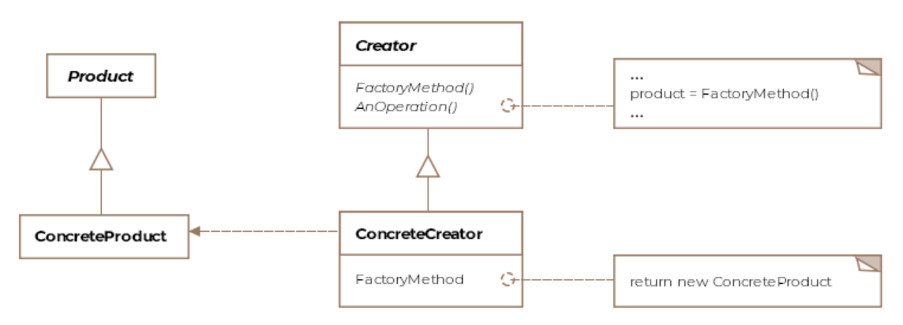

# Factory Method Pattern

The factory method pattern produces objects.

Do not mix up the `factory method pattern` with the `factory pattern`,
these are not the same.

In the factory method pattern you always have some generic part that
is common and a specific part that is unique to the object you want
to create.

## Class Diagram




The `concreteCreator` calls the factory method of the parent class,
then does it's special thing and returns an object of type
`ConcreteProduct`.

## Example

```Java
public class F16 {

    IEngine engine;
    ICockpit cockpit;

    protected F16 makeF16() {
        engine = new F16Engine();
        cockpit = new F16Cockpit();
        return this;
    }

    public void taxi() {
        System.out.println("F16 is taxing on the runway !");
    }

    public void fly() {
        // Note here carefully, the superclass F16 doesn't know
        // what type of F-16 variant it was returned.
        F16 f16 = makeF16();
        f16.taxi();
        System.out.println("F16 is in the air !");
    }
}

public class F16A extends F16 {

    @Override
    public F16 makeF16() {
        super.makeF16();
        engine = new F16AEngine();
        return this;
    }
}

public class F16B extends F16 {

    @Override
    public F16 makeF16() {
        super.makeF16();
        engine = new F16BEngine();
        return this;
    }
}
```

When `fly()` is called on the parent object, makeF16 is called, which is overriden
by the child class. The child then calls the parents `makeF16()` method which
creates an `F16` object which's engine is then replaced by the specifc one.

Client:
```Java
public class Client {
    public void main() {
        Collection<F16> myAirForce = new ArrayList<F16>();
        F16 f16A = new F16A();
        F16 f16B = new F16B();
        myAirForce.add(f16A);
        myAirForce.add(f16B);

        for (F16 f16 : myAirForce) {
            f16.fly();
        }
    }
}
```
