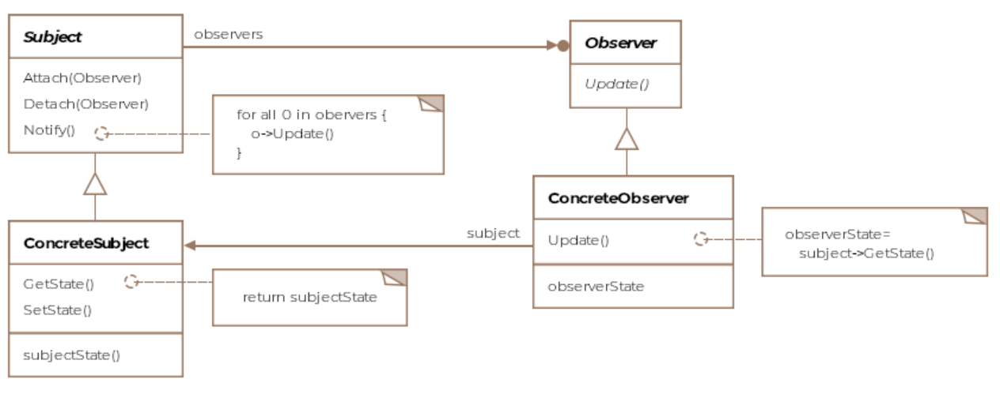
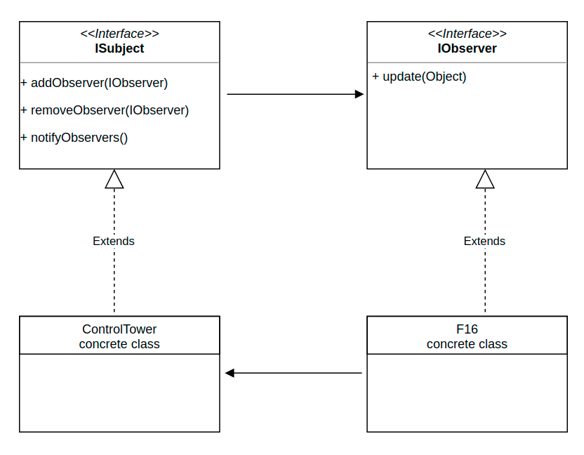

# Observer Pattern

The observer pattern describes how updates from an object can be communicated
to other objects effectively.

Social media helps us immensely in understanding the observer pattern. If you
are registered on Twitter then whenever you follow someone, you are
essentially asking Twitter to send you (the observer) tweet updates of the
person (the subject) you followed. The pattern consists of two actors, the
observer who is interested in the updates and the subject who generates the
updates.

A subject can have many observers and is a one to many relationship. However,
an observer is free to subscribe to updates from other subjects too. You can
subscribe to news feed from a Facebook page, which would be the subject and
whenever the page has a new post, the subscriber would see the new post.

## Class Diagram



To ensure loose coupling we'll define an interface for the subject and one for
the observer.

```Java
public interface ISubject {

    void addObserver(IObserver observer);

    void removeObserver(IObserver observer);

    void notifyObservers();
}

public interface IObserver {

    void update( Object newState);
}
```

## Example

Going back to our aircraft example, we can say that any aircraft in flight
would be interested in updates from the air-traffic controller. We can imagine
that an aircraft, as soon as, it is airborne would want to subscribe to
updates from the air traffic controller and unsubscribe when it lands.

A

### Publisher Code

We create a control tower class which acts as a publisher for all aircraft.

```Java
public class ControlTower implements ISubject {

    // The ControlTower maintains a list of
    Collection<IObserver> observers = new ArrayList<>();

    @Override
    public void addObserver(IObserver observer) {
        observers.add(observer);

    }

    @Override
    public void removeObserver(IObserver observer) {
        // Logic to remove the observer goes in here
    }

    @Override
    public void notifyObservers() {
        for (IObserver observer : observers) {
            // We are passing null for state here but we
            // could pass 'this' the subject itself or a
            // type representing the state. These two options
            // represent the Pull vs Push models
            observer.update( null);
        }
    }

    /**
     * This is hypothetical function that runs perptually, gathering
     * runway and weather conditions and notifying all observers of
     * them periodically.
     */
    public void run() {

        while (true) {
            // get new runway/weather conditions and update observers
            // every five minutes
            // Thread.sleep(1000 * 60 * 5)
            notifyObservers();
        }
    }
}
```

### Observer Code

The F-16 class would implement the `IObservable` as objects of the F-16 class
would want updates from the `ControlTower` class.

```Java
public class F16 implements IObserver, IAircraft {

    ISubject observable;

    public F16(ISubject observable) {
        this.observable = observable;
        observable.addObserver(this);
    }

    @Override
    public void fly() {
        System.out.println("F16 is flying ...");

    }

    @Override
    public void land() {

        // Don't forget to unsubscribe from control tower updates
        observable.removeObserver(this);
    }

    @Override
    public void update(Object newState) {
        // Take appropriate action based on newState
    }
}
```

## Push vs Pull

Note how the F-16 class receives the new state as a type of class Object.
We can pass in a more specific type if we agree on what information gets
passed. The way the code is structured, it represents the Push Model where the
subject is responsible for pushing the new state. Say if the aircraft is a
helicopter, is it really interested in the runway conditions? It's supposed to
land on a helipad and may not use all the information that it gets passed for
the runway.

A flip solution is that in the update method, instead of passing in the changed
state, we pass in the subject object itself. The subject-object in turn exposes
getter methods for individual pieces of information it is willing to share with
the observers. The observer is now able to lookup only that information which
it finds interesting. This is called the Pull Model.
