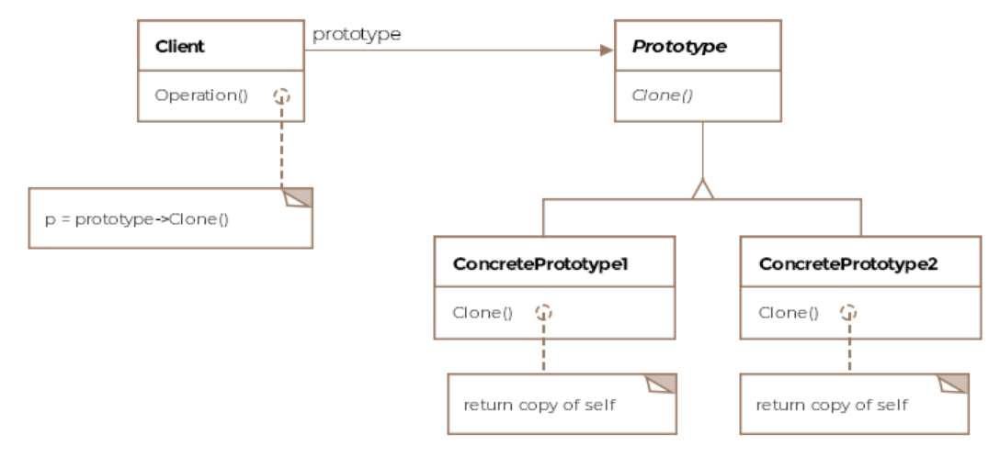

# Prototype Pattern

Creates new objects from existing objects.

Prototype pattern involves creating new objects by copying existing 
objects. The object whose copies are made is called the prototype. 
You can think of the prototype object as the seed object from which
other objects get created.

Why would we want to do this?
1. Sometimes creating new objects is more expensive than copying 
existing objects.
1. A class which is instantiated by a third party and you never
have access to the constructor
1. The number of classes in a system can be greatly reduced by
varying the values of a cloned object from a prototypical instance.

## Class Diagram



## Example

Here an example of a F16 which can exist with two different engines.

The aircraft prototype interface:

```Java
public interface IAircraftPrototype {

    void fly();

    IAircraftPrototype clone();

    void setEngine(F16Engine f16Engine);
}
```

F16s implementing the interface:

```Java
public class F16 implements IAircraftPrototype {

    // default engine
    F16Engine f16Engine = new F16Engine();

    @Override
    public void fly() {
        System.out.println("F-16 flying...");
    }

    @Override
    public IAircraftPrototype clone() {
        // Deep clone self and return the product
        return new F16();
    }

    public void setEngine(F16Engine f16Engine) {
        this.f16Engine = f16Engine;
    }
}
```

Client:

```Java
public class Client {

    public void main() {

        IAircraftPrototype prototype = new F16();

        // Create F16-A
        IAircraftPrototype f16A = prototype.clone();
        f16A.setEngine(new F16AEngine());

        // Create F16-B
        IAircraftPrototype f16B = prototype.clone();
        f16B.setEngine(new F16BEngine());
    }
}
```
