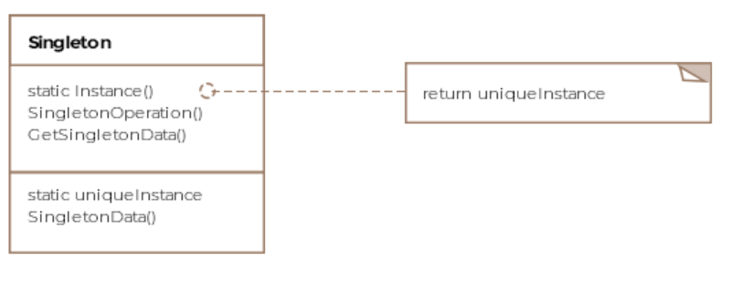

# Singleton Pattern

The singleton pattern enforces only a single instance of an object.

In general it's done by making the constructor private and therefore
only allowing only the members to access the constructor.

## Class diagram



## Code

For example we want to create the Air Force One, of which only 
one exists.

```Java
public class AirforceOne {

    // The sole instance of the class
    private static AirforceOne onlyInstance;

    // Make the constructor private so its only accessible to
    // members of the class.
    private AirforceOne() {
    }

    public void fly() {
        System.out.println("Airforce one is flying...");
    }

    // Create a static method for object creation
    public static AirforceOne getInstance() {

        // Only instantiate the object when needed.
        if (onlyInstance == null) {
            onlyInstance = new AirforceOne();
        }

        return onlyInstance;
    }
}

public class Client {

    public void main() {
        AirforceOne airforceOne = AirforceOne.getInstance();
        airforceOne.fly();
    }
}
```

## Multithreading and Singletons

In the above example, a race condition can arise if two threads call `getInstance()`
at the same time. One thread could check `onlyInstance` and then be halted, which
could open up the possibility for other threads to enter this critical section too.

### Solutions

1. Use keyword `synchronised` for the `getInstance()` method.
1. Use a static initialisation of the instance: `private static AirforceOne onlyInstance = new AirforceOne();`


