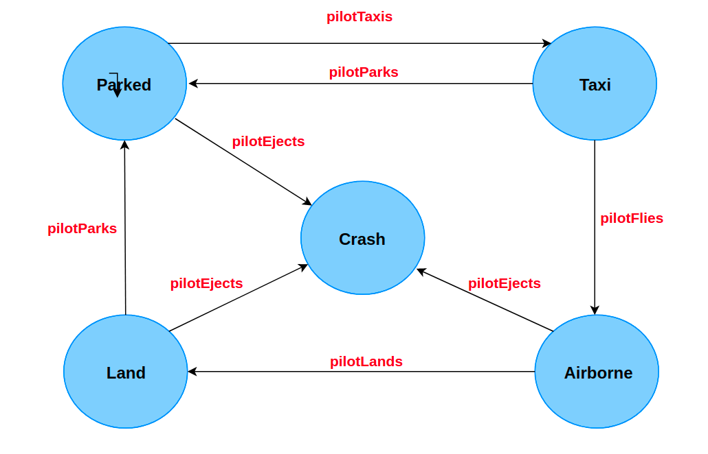

# State Design Pattern

The state pattern encapsulates the various states a machine can be in. The
machine or the context, as it is called in pattern-speak, can have actions
taken on it that propel it into different states. Without the use of the
pattern, the code becomes inflexible and littered with if-else conditionals.

## Class Diagram


## Example

Take the `F16` class. An instance of the class can be in various states. 
Some possible states and transitions to other states are listed below:

Parked -> Crash or Taxi
Taxi -> Airborne or Parked
Airborne -> Crash or Land
Land -> Taxi
Crash -> No transition out of this state



The verbs in red in the state diagram are *actions* that propel the aircraft
into different states.

The state pattern will create classes for each of the possible states and each
class implements the state-specific behavior. This will result in more number
of classes but the design will become flexible and extensible as you'll
shortly see. First let's capture the actions a pilot can take, in an
interface, which is the State Interface. This interface would then be
implemented by the different states a F-16 can be in.

```Java
/**
 * This interface defines the actions a pilot
 * can take against the aircraft object. Each
 * action will move the aircraft into a different
 * state
 */
public interface IPilotActions {

    void pilotTaxies(F16 f16);

    void pilotFlies(F16 f16);

    void pilotEjects(F16 f16);

    void pilotLands(F16 f16);

    void pilotParks(F16 f16);
}
```

Now let's see how a state would implement this interface. Let's start with the
ParkedState. For brevity, we'll only show the parked state class. Each of the
other states will have a corresponding class that'll code behavior for the F-16
in that state.

```Java
public class ParkedState implements IPilotActions {

    F16 f16;

    // Notice, how the state class is composed with the context object
    public ParkedState(F16 f16) {
        this.f16 = f16;
    }

    @Override
    public void pilotTaxies(F16 f16) {
        f16.setState(f16.getTaxiState());
    }

    @Override
    public void pilotFlies(F16 f16) {
        System.out.println("This is an invalid operation for this state");
    }

    @Override
    public void pilotEjects(F16 f16) {
        f16.setState(f16.getCrashState());

    }

    @Override
    public void pilotLands(F16 f16) {
        System.out.println("This is an invalid operation for this state");
    }

    @Override
    public void pilotParks(F16 f16) {
        System.out.println("This is an invalid operation for this state");
    }
}
```

Note how the constructor accepts an instance of the context and saves a
reference to it. The plane can only transition to `TaxiState` or `CrashedState`
from the `ParkedState`. Either the pilot successfully revs up the engine and
takes the plane on the runway or he presses eject if say a fire breaks out on
ignition. In our state transition model, you can see that `CrashedState` is a
terminal state and there are no transitions out of this state. One can't park,
fly, taxi, land or crash again a crashed plane.

The client will use our new set of classes like so:

```Java
public class Client {

    public void main() {

        F16 f16 = new F16();
        f16.startsEngine();
        f16.fliesPlane();
        f16.ejectsPlane();

    }
}
```

For completeness, the F16 class and the associated interface appear below:

```Java
public interface IAircraft {
   //Empty interface
}

public class F16 implements IAircraft {

    private ParkedState parkedState = new ParkedState(this);
    private CrashState crashState = new CrashState(this);
    private LandState landState = new LandState(this);
    private TaxiState taxiState = new TaxiState(this);
    private AirborneState airborneState = new AirborneState(this);

    IPilotActions state;

    public F16() {
        state = parkedState;
    }

    void startsEngine() {
        state.pilotTaxies(this);
    }

    void fliesPlane() {
        state.pilotFlies(this);
    }

    void landsPlane() {
        state.pilotLands(this);
    }

    void ejectsPlane() {
        state.pilotEjects(this);
    }

    void parksPlane() {
        state.pilotParks(this);
    }

    void setState(IPilotActions IPilotActions) {
        state = IPilotActions;
    }

    ParkedState getParkedState() {
        return parkedState;
    }

    CrashState getCrashState() {
        return crashState;
    }

    LandState getLandState() {
        return landState;
    }

    TaxiState getTaxiState() {
        return taxiState;
    }

    public AirborneState getAirborneState() {
        return airborneState;
    }

}
```

We have delegated the transitions to the state classes. They decide what would
be the next state depending on the action the pilot takes.

This pattern may seem very similar to the Strategy Pattern, however, the intent
of the two patterns is very different. In strategy, the client is actively
composing the context with the strategy object whereas, in the state pattern,
the client has no view of the state the context is currently in. The context
may show a different behavior for being in a different state. It might appear
to the client that the context is a different class altogether when in fact
it's only in a different state.

For our example when the F-16 is airborne it becomes capable of using its
weapons, firing missiles, destroying tanks etc, all of which it can't do in the
parked state. The alteration in the behavior that comes with the state change,
almost makes the object appear to belong to a different class.
