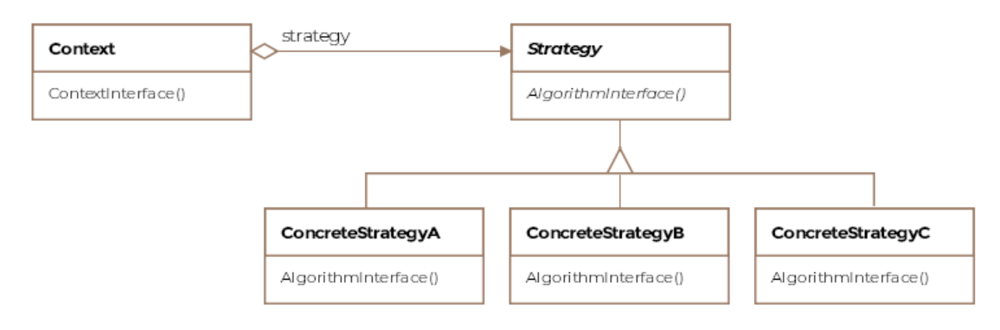

# Strategy Design Pattern

The strategy is a pattern that allows swaping a algorithm or policy without
the client noticing.

The strategy pattern is one of the simpler patterns to comprehend. It allows
grouping related algorithms under an abstraction, which the client codes
against. The abstraction allows switching out one algorithm or policy for
another without modifying the client.

The strategy pattern is formally defined as encapsulating algorithms belonging
to the same family and making them interchangeable. The consumers of the common
interface that the algorithms implement allow switching out one algorithm for
another seamlessly.

## Class Diagram



## Example

Concrete algorithms implement the same interface. The context has the data the
algorithm will act on. Together the context and the strategy interact to
implement the chosen algorithm. Usually, clients instantiate the context and
pass in the strategy object and then, only interact with the context object.

The most trivial example one can think of is the family of sorting algorithms.
Say our application is only concerned with sorting integer arrays. All the
sorting algorithms can implement a common interface, that we call `ISort`.

```Java
public interface ISort {

    void sort(int[] input);
}
```

The concrete implementations of the interface appear below:

```Java
public class BubbleSort implements ISort {

    @Override
    public void sort(int[] input) {
        // Do inefficient sorting in order n squared
    }
}

public class MergeSort implements ISort {

    @Override
    public void sort(int[] input) {
        // Do efficient sorting in nlogn
    }
}
```

The Context class holds a reference to the strategy object and when it receives
requests from its clients, it forwards them to the strategy object along with
the required data.

```Java
public class Context {

    private ISort howDoISort;

    public Context(ISort howDoISort) {
        this.howDoISort = howDoISort;
    }

    // Context receives the data from its client
    // and passes it on to the strategy object.
    void sort(int[] numbers) {
        howDoISort.sort(numbers);
    }

    // We can change the sorting algorithm using this setter
    public void setHowDoISort(ISort howDoISort) {
        this.howDoISort = howDoISort;
    }
}
```

The client can use the context like so:

```Java
public class Client {

    private int[] numbers = new int[1000];

    void crunchingNumbers() {

        // Choose the sorting strategy
        BubbleSort bubbleSort = new BubbleSort();

        // Context receives the strategy object
        Context context = new Context(bubbleSort);

        // Sort the numbers
        context.sort(numbers);

        // Do remaining work
    }
}
```

Notice how the context keeps an interface reference and can be configured with
any concrete sort implementation. The implementation can also be changed at
runtime through the setter. This decoupling of the client and the algorithms,
allows us to vary the algorithms independent of the client.
