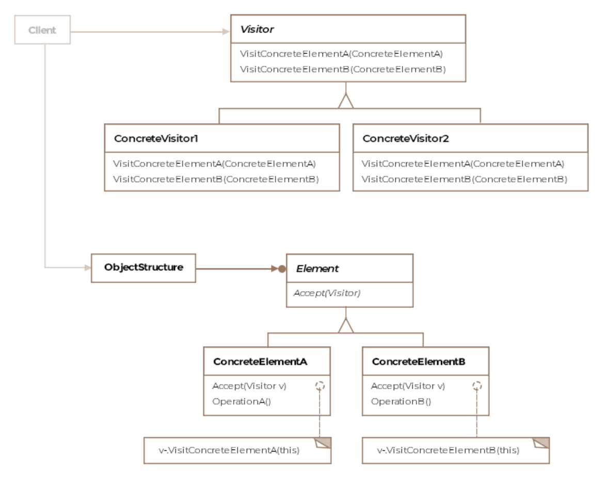

# Visitor Design Pattern

The visitor pattern adds behavior to composites without modifying the
composite's or it's underlying elements' class. 

The visitor pattern allows us to define an operation for a class or a class
hierarchy without changing the classes of the elements on which the operation
is performed.

Recall the Airforce class example from the Composite Pattern lesson. The
Airforce class is a composite consisting of several different kinds of
airplanes. It can be thought of as the object structure on whose elements we
want to conduct operations. The elements would be the individual planes that
make up the airforce object structure.

Say if we are tasked with monitoring of various metrics for each aircraft such
as remaining fuel, altitude and temperature then one option would be to build
this functionality inside the abstract class of all the airplanes. The
consequence would be that we'll need to implement the new methods in all the
airplane subclasses. Now imagine, a few days later we are tasked with
calculating the total price tag for the Airforce. We will now add another
method to the abstract airplane class or interface that'll return the price
for each individual plane and sum it across all the airplanes.

There are several problems in our scenario, first the airplane class shouldn't
be responsible for monitoring or pricing data.  It should just represent the
aircraft. With each additional functionality, we'll end up bloating our
aircraft classes with new unrelated methods. The visitor patterns lets us out
of this dilemma by suggesting to have a separate class that defines the new
functionality related to the aircraft.

The methods in the AircraftVisitor class would take the aircraft object as an
argument and work on it. This saves us from changing our aircraft classes each
time we need to support a new functionality relating to the Airforce class.

## Class Diagram



## Example

Let's revisit our airforce example. The airforce class is the object structure
on which we desire to introduce two new operations, one for collecting metrics
for all the planes and two the cost of each aircraft. Let's see the `Airforce`:

```Java
public class Airforce {

    // Holds a collection of planes
    private Collection<IAircraft> planes = new ArrayList<>();

    // Returns an iterator to its collection of planes
    public Iterator<IAircraft> getIterator() {
        return planes.iterator();
    }
}
```

We'll consider two types of airplanes, the `F16` and `Boeing747`. The interface
defines an `abstract accept(IAircraftVisitor visitor)` method that must be
implemented by all derived classes. This method allows the visitor to access
the concrete class's interface, as you'll shortly see. The listing comes below:

```Java
public interface IAircraft {

    // Each concrete element class is expected to
    // define the accept method
    public void accept(IAircraftVisitor visitor);

}

public class F16 implements IAircraft {

    @Override
    public void accept(IAircraftVisitor visitor) {
        visitor.visitF16(this);
    }
}

public class Boeing747 implements IAircraft{

    @Override
    public void accept(IAircraftVisitor visitor) {
        visitor.visitBoeing747(this);
    }
}
```

Now we'll define the interface `IAircraftVisitor` and the two concrete visitors.

```Java
public interface IAircraftVisitor {

    void visitF16(F16 f16);

    void visitBoeing747(Boeing747 boeing747);
}
```

Notice how the visitor interface defines a visit method for each of the
concrete types that make up the object structure. Say if a new airplane C-130
was added to the object structure then the IAircraftVisitor would need to
introduce a new method visitC130. The visitor interface allows each aircraft
to pass itself to the visitor by calling the correponding visit method for its
class on the visitor object. The visitor classes are given below:

```Java
public class MetricsVisitor implements IAircraftVisitor {

    public void visitF16(F16 f16){
        // Logic to get metrics for F16
    }

    public void visitBoeing747(Boeing747 boeing747){
        // Logic to get metrics for Boeing 747
    }

    public void printAccumulatedResults(){

    }
}

public class PriceVisitor implements IAircraftVisitor{

    @Override
    public void visitF16(F16 f16) {
        // Logic to get price for F16
    }

    @Override
    public void visitBoeing747(Boeing747 boeing747) {
        // Logic to get price for Boeing 747
    }

    public void printAccumulatedResults(){

    }
}
```

Note that each visitor can invoke methods specific to each concrete class. 
Even though the two airplane classes share the same interface, the pattern
allows us to work with classes that are unrelated or don't share a common
interface. Finally, the client code will look like below:

```Java
public class Client {

    public void main(Airforce airforce) {

        Iterator<IAircraft> planes = airforce.getIterator();
        MetricsVisitor aircraftVisitor = new MetricsVisitor();

        while (planes.hasNext()){
            planes.next().accept(aircraftVisitor);
        }

        aircraftVisitor.printAccumulatedResults();
    }
}
```

If we want to define a new operation on the object structure, then it is as
easy as adding a new visitor class.

Each object structure will have an associated visitor class. This visitor
interface will need to declare a visitConcreteElement operation for each class
of concreteElement defining the object structure. Each visit method on the
visitor interface will need to declare its argument to be a particular
`concreteElement`, allowing the visitor to access the interface of the
`concreteElement` directly.

## More basic implementation in C++

Each concrete element accepts a visitor.

In the `visit` method of the concrete visitor, the visitor can do whatever is
necessary to achieve the job. That might be a specific thing tailored to
the concrete element visited.

```cpp
class element_concrete_1;
class element_concrete_2;

class visitor
{
  public:
    virtual void visit(element_concrete_1& el) = 0;
    virtual void visit(element_concrete_2& el) = 0;
};

class visitor_concrete : public visitor
{
  public:
    virtual void visit(element_concrete_1& el) override
    {
      // Do something with el
    };
    virtual void visit(element_concrete_2& el) override
    {
      // Do something with el
    };
};

class element
{
  public:
    virtual void accept(visitor& v) = 0;
};

class element_concrete_1 : public element
{
  public:
    virtual void accept(visitor& v) override
    {
      v.visit(*this);
    }
};

class element_concrete_2 : public element
{
  public:
    virtual void accept(visitor& v) override
    {
      v.visit(*this);
    }
};
```
